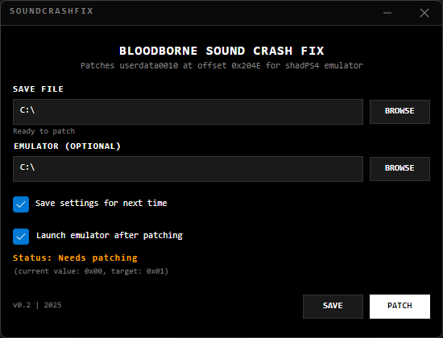
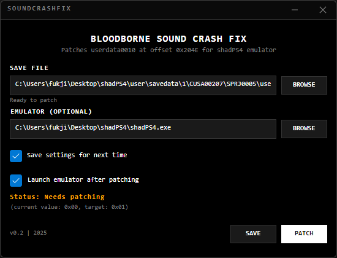

# SoundCrashFix for Bloodborne (shadPS4) v0.2
# SoundCrashFix for Bloodborne (shadPS4) v0.2

A complete toolkit that fixes sound crash issues in Bloodborne when running on the shadPS4 emulator.
A complete toolkit that fixes sound crash issues in Bloodborne when running on the shadPS4 emulator.

## Overview

This tool patches the `userdata0010` save file to prevent sound-related crashes that occur when Bloodborne is not properly exited on the shadPS4 emulator. It modifies a single byte at offset `0x204E` from `0x00` to `0x01`, resolving the audio crash issue.

## Features

### v0.2 Features
- **GUI Version**: Modern terminal-style interface for casual users
- **Auto-Detection**: Automatically finds save files and emulator paths
- **Settings Persistence**: Save your configuration for next time
- **Cross-Platform Support**: Works on Windows, macOS, and Linux
- **Custom Window Chrome**: Clean, minimal interface design

### Core Features
### v0.2 Features
- **GUI Version**: Modern terminal-style interface for casual users
- **Auto-Detection**: Automatically finds save files and emulator paths
- **Settings Persistence**: Save your configuration for next time
- **Cross-Platform Support**: Works on Windows, macOS, and Linux
- **Custom Window Chrome**: Clean, minimal interface design

### Core Features
- **Automatic Patching**: Patches the save file with a single click
- **Safe Operation**: Checks if patching is needed before making changes
- **Emulator Integration**: Automatically launches shadPS4 after patching
- **Simple CLI**: Clear console output showing patch status
- **Error Handling**: Validates file paths and handles errors gracefully

## Available Versions

- **CLI Version**: Command-line tool (.NET Framework 4.7.2 - Windows only)
- **GUI Version**: Graphical interface (Avalonia - Cross-platform)

### GUI Preview


*Modern terminal-style interface with auto-detection and one-click patching*

## Available Versions

- **CLI Version**: Command-line tool (.NET Framework 4.7.2 - Windows only)
- **GUI Version**: Graphical interface (Avalonia - Cross-platform)

### GUI Preview


*Modern terminal-style interface with auto-detection and one-click patching*

## Requirements

- **CLI**: Windows OS, .NET Framework 4.7.2 or higher
- **GUI**: .NET 9.0 (Windows, macOS, Linux)
- **CLI**: Windows OS, .NET Framework 4.7.2 or higher
- **GUI**: .NET 9.0 (Windows, macOS, Linux)
- shadPS4 emulator
- Bloodborne game files configured in shadPS4

## Project Structure

```
SoundCrashFix/
├── SoundCrashFix.exe       # Main patching tool
├── run_soundcrashfix.bat   # Batch script for automated workflow
├── Program.cs              # Source code (C#)
├── SoundCrashFix.csproj    # Project file
└── SoundCrashFix.sln       # Solution file
```

## How It Works

1. The tool locates your Bloodborne save file (`userdata0010`)
2. Reads the current value at offset `0x204E`
3. If needed, patches the value from `0x00` to `0x01`
4. Launches shadPS4 emulator automatically

## Installation

See [HOWTO.md](HOWTO.md) for detailed installation and usage instructions.

## Technical Details

- **Target File**: `userdata0010` in the SPRJ0005 save directory
- **Patch Offset**: `0x204E`
- **Original Value**: `0x00`
- **Patched Value**: `0x01`
- **Language**: C# (.NET Framework 4.7.2)

## Troubleshooting

### Common Issues

1. **"File not found" error**
   - Verify the path to `userdata0010` in the batch file
   - Ensure the save file exists (play the game at least once)

2. **"Access denied" error**
   - Run the tool as administrator
   - Close shadPS4 before running the patch

3. **Patch not working**
   - Verify you're using the correct game version
   - Check that the save file path includes `SPRJ0005`

## Links

- [Nexus Mods Page](https://www.nexusmods.com/bloodborne/mods/165)
- [GitHub Repository](https://github.com/LL4nc33/SoundCrashFix)

## License

This tool is open source. You can modify and distribute it freely.

## Credits

- Original Author: LL4nc33
- Tool fixes a known issue with Bloodborne on shadPS4 emulator

## Disclaimer

This tool modifies save game files. Always backup your saves before using any modification tools.